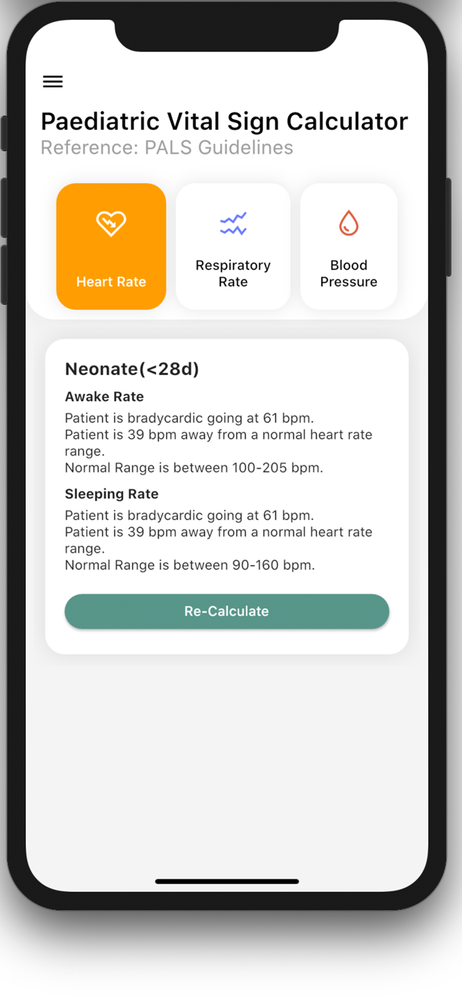

# Paed-Obst-Calculator

Created by a Healthcare professional, for other healthcare professional. This app provides 2 calculators for Obstetrics and Paediatrics.

Users will be able to calculate gestation week, Last Menstrual Period and Estimated Date of Delivery and calculate if the paediatric vital sign is within range. 

DISCLAMER
The information provided by the app is not necessarily correct or accurate. It is based on available information and we do not accept any medical responsibility.

All information, content, and material of the app is for informational purposes only and are not intended to serve as a substitute for the consultation, diagnosis, and/or medical treatment of a qualified physician or healthcare provider.

 |  
